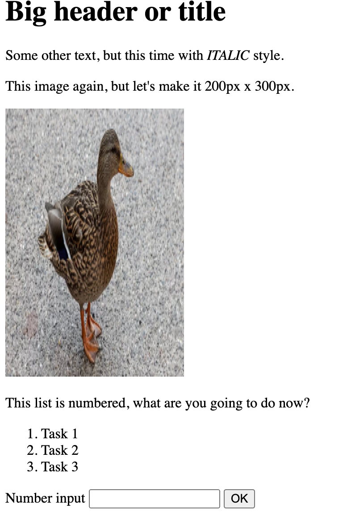

Make a layout based on that screenshot:




```
Here is raw text:

Big header or title

Some other text, but this time with ITALIC style.

This image again, but let's make it 200px x 300px.

This list is numbered, what are you going to do now?
Task 1
Task 2
Task 3
```