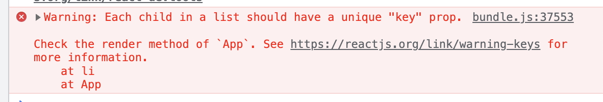

# Iterating over collections

## Why?

React is fast by default, but sometimes it needs a little bit of help. The most common case is when we need to display a collection of elements. Let's assume the following code:

```jsx
const collection = ["arm", "forearm", "hand", "pelvis"];

return (
  <ul>
    {collection.map((item) => (
      <li>{item}</li>
    ))}
  </ul>
);
```

It DOES work, but we receive an error in our dev console:



What's that mysterious `key` property? It helps React to know which elements need re-render during an iteration. Without it, it will re-render entire list each time it changes - which may be silly if the lists contains thousands of items.

What about now?

```jsx
const collection = ["arm", "forearm", "hand", "pelvis"];

return (
  <ul>
    {collection.map((item) => (
      <li key={item}>{item}</li>
    ))}
  </ul>
);
```

No warning now!

## Good keys

How do we find a _good_ key? First of all, it should be unique. Secondly, it shouldn't change with each render - it would be best if it's a natural property of a collection, e.g. a PESEL for iterating over people. Would combination of first and last name do any good?

```jsx
const collection = [
  {
    firstName: "Brandom",
    lastName: "Sanderson",
  },
  {
    firstName: "Howard",
    secondName: "Phillips",
    lastName: "Lovecraft",
  },
];

return (
  <ul>
    {collection.map((person) => (
      <li key={person.firstName + person.lastName}>{
        // put person data here...
      }</li>
    ))}
  </ul>
);
```

## Index as key?

It may seem a good idea to use an index as a key. It's unique, right?

```jsx
collection.map((person, index) =>  <li key={index} ...
```

Actually, it's a beautiful antipattern - if we remove/insert an element in the middle of the collection, all elements after will re-render!

However, it may make sense for collections that **never** change.
